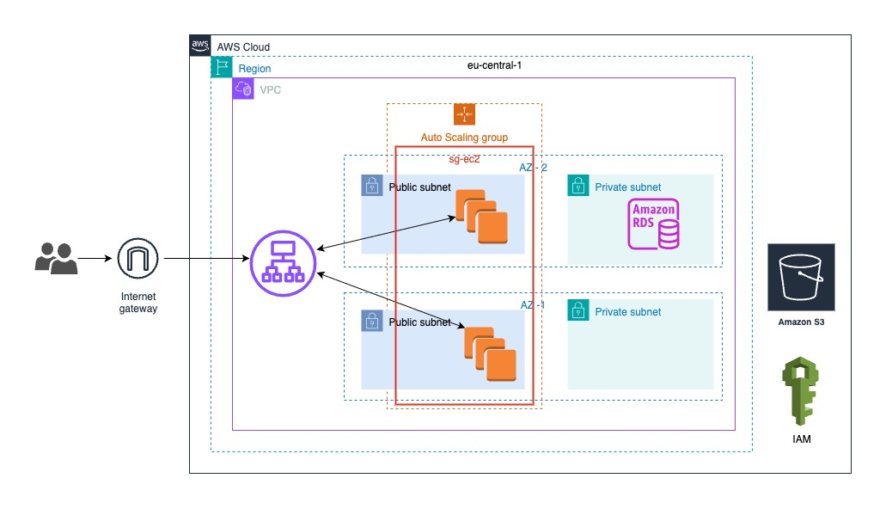
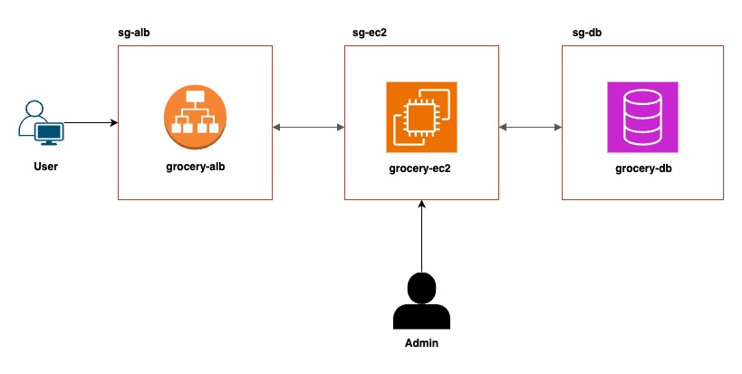

# Cloud-Native Grocery Web App

- AWS infrastructure for the Grocery App.
- Includes backend API and frontend webapp.

---

## 📌 Table of Contents

- [Project Overview](#-project-overview)
- [AWS Services Used](#aws-services-used)
- [Prerequisites](#-prerequisites)
- [Architecture Overview](#architecture-overview)
- [Features & Skills](#devops-features--cloud-skills)
- [Contributing](#-contributing)

--- 

# 🚀 Project Overview

This project is part of the Cloud Track in our Masterschool Software Engineering bootcamp. Originally developed by our Track Mentor, Alejandro Román. My task was to design and deploy its AWS infrastructure step by step.

This project showcases a **containerized, cloud-native grocery web application** deployed on **AWS**.  
It emphasizes **DevOps principles**, **Infrastructure as Code (IaC)**, and **scalable, secure architecture** using a range of AWS services.

---

## AWS Services Used

- **EC2** – Host Docker containers running the web app
- **VPC, Subnets, Security Groups** – Custom network configuration
- **S3** – Store static assets and backups  
- **Application Load Balancer (ALB)** – Distribute traffic across EC2 instances  
- **RDS (PostgreSQL)** – Managed relational database for persistent storage  
- **IAM** – Secure access control   
- **Terraform** – Infrastructure provisioning via code  

---

## 📋 Prerequisites
Please make sure that you have the following installed on your system :
- **Python (>=3.11)**
- **🐘 PostgreSQL** – Database for storing product and user information.
- **🛠️ Git** – Version control system.
- **AWS**
- **Terraform**
- **Docker**

---

## Architecture Overview

- Traffic is routed through an **Application Load Balancer (ALB)** for high availability.  
- A **PostgreSQL database (RDS)** handles backend data storage.  
- **Static content** is hosted in an **S3 bucket**.  
- The application is **containerized using Docker** and deployed on **EC2 instances**.  
- Infrastructure can be managed via **Terraform** for **repeatable deployments**.





---

## DevOps Features & Cloud Skills

- Dockerized deployment on EC2  
- AWS-native architecture with modular design  
- Full **Infrastructure as Code** using Terraform  
- Secure **IAM setup** and fine-grained access control  
- **PostgreSQL provisioning** and initialization on Amazon RDS  
- **Load balancing with ALB** for high availability  
- **Static asset hosting with S3**  
- Public/private subnets, security groups, and routing  

---

## 🤝 Contributing

1. Fork the version2/ latest version of this repository:
```sh
https://github.com/AlejandroRomanIbanez/AWS_grocery.git && cd AWS_grocery
```
2. Create a new feature branch (`feature/your-feature`).
3. Implement your changes and create a pull request.
